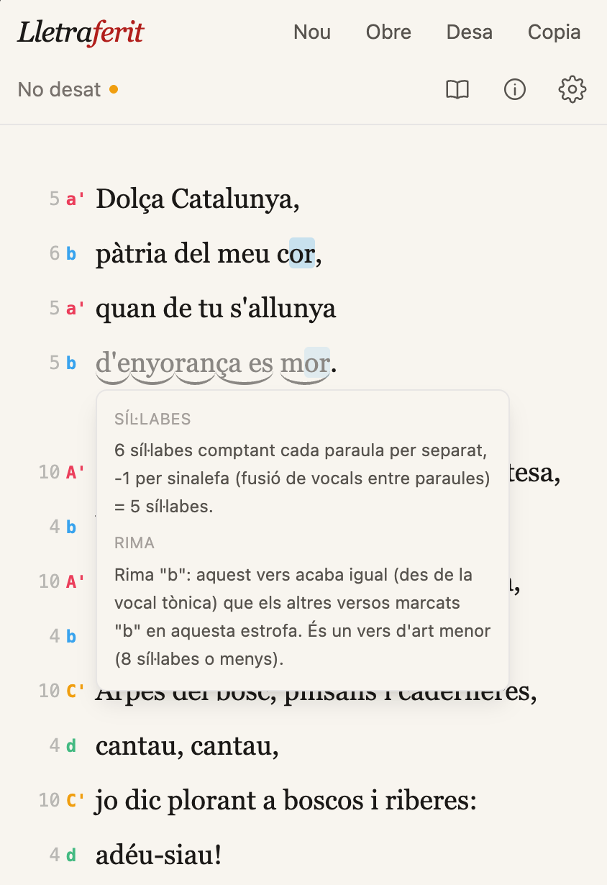

# Lletraferit

[](https://github.com/albertpuente/lletraferit/actions/workflows/deploy.yml)
[](https://github.com/albertpuente/lletraferit/actions/workflows/tests.yml)
[](https://oxc.rs/docs/guide/usage/linter.html)
[](https://react.dev/)
[](https://www.typescriptlang.org/)
[](LICENSE)



A small, client-only web app for writing poetry in Catalan. 

> **Lletraferit, -ida** *(adj., Catalan)* - literally "letter-wounded"; someone struck, smitten, or
> afflicted by literature. A person hopelessly devoted to writing and the written word.

### [**Open Lletraferit 🔗**](https://albertpuente.github.io/lletraferit/)

It's a plain text
editor that also counts syllables per verse as you type, detects rhyme scheme, flags misspelled
words, and suggests synonyms. All computed locally in the browser, with no server, account, or
network dependency once loaded.

**Table of contents:**
- [Features](#features)
- [Architecture](#architecture)
- [License](#license)
- [Getting started](#getting-started)
- [Deployment](#deployment)

<br clear="right">

## Features

- **Live syllable count** - a per-line gutter shows the metrical syllable count for each verse,
  applying Catalan rules for sinalefa (vowel fusion across word boundaries) and the
  "count-to-the-last-stress" convention (aguda/plana/esdrúixola endings). A dièresi (ï/ü) can be
  used to force a hiatus where the automatic analysis would assume a diphthong or sinalefa.
- **Rhyme scheme detection** - verses are grouped by matching phonetic endings (from the stressed
  vowel onward) and labelled with the traditional lettering convention (A, B, C…, upper/lowercase
  for art major/menor, an apostrophe for plana endings), scoped per stanza.
- **Click-to-explain metrics** - clicking a line's syllable count or rhyme letter opens a popup
  explaining exactly how that number or letter was derived.
- **Classic structure reference** - a panel of well-known Catalan poetic forms (sonet, quartets,
  romanç, haikú, etc.) with their expected verse lengths and rhyme patterns, as a cheat sheet.
- **Offline Catalan spellchecking** - the real Hunspell engine (compiled to WebAssembly via
  `hunspell-asm`) runs a Central-or-Valencian-variant dictionary in a Web Worker and underlines
  unrecognized words.
- **Click-a-word synonyms** - clicking any word looks it up in an offline Catalan thesaurus and
  offers alternatives, which can be inserted with one click.
- **Local file storage** - documents autosave to the browser (IndexedDB) and can also be opened
  from / saved directly to disk via the File System Access API, with a download/upload fallback on
  browsers that don't support it.
- **Light/dark themes**, an optional subtle paper texture, and a responsive layout that works on
  phones as well as desktops.

## Architecture

Built with **Vite + React + TypeScript**, styled with **Tailwind CSS**, and edited with
**CodeMirror 6**. There is no backend - everything runs client-side.

```
src/
  engine/        Pure-TS Catalan metrics engine: syllabification, stress detection,
                 sinalefa, rhyme phonetics, rhyme-scheme and verse-type classification.
                 No dependency on the editor or DOM - independently unit-tested (Vitest).
  editor/        CodeMirror integration: the syllable/rhyme gutter, spellcheck-underline
                 decoration, word-click handling, typing animation, and the glue that
                 feeds editor content through the engine on every change.
  spellcheck/    Web Worker + client for offline Hunspell-based Catalan spellchecking.
  synonyms/      Client for the offline Catalan thesaurus (a build-time-compiled JSON index).
  storage/       IndexedDB (documents, settings) and File System Access API wrappers.
  structures/    Static reference data for classic Catalan poetic forms.
  hooks/         React hooks tying documents, settings, and theme state together.
  components/    UI: toolbar, settings/structures panels, synonym/metrics popups.
```

The metrics engine is a heuristic, spelling-based approximation of Catalan phonology - it covers
the general rules well but isn't a full linguistic analyzer, and its output has been spot-checked
against real published poems (not formally verified against a reference corpus).

### Data sources

- Spellcheck dictionaries: `dictionary-ca` / `dictionary-ca-valencia` (Hunspell format, npm).
- Synonyms: [Softcatalà's Diccionari de sinònims](https://github.com/Softcatala/sinonims-cat)
  (CC-BY 4.0), compiled into `public/dictionaries/synonyms.json` via `npm run build:synonyms`
  (not run automatically since it requires network access - see below).

## License

Copyright © 2026 Albert Puente Encinas. Lletraferit is licensed under the
[GNU General Public License v3.0 or later](LICENSE). Bundled dictionaries and
synonym data remain subject to their respective licenses.

## Getting started

```sh
npm install
npm run dev             # start the dev server
npm run build           # type-check and build for production
npm run test            # run the engine's unit test suite
npm run build:synonyms  # optional: (re)generate the synonyms dictionary
```

## Deployment

Pushes to `main` automatically build and deploy the app to GitHub Pages via
[`.github/workflows/deploy.yml`](.github/workflows/deploy.yml). The workflow installs
dependencies, regenerates the synonyms dictionary, runs the test suite, builds the site
(`vite build`, with `base: '/lletraferit/'` for this project-site path), and publishes
`dist/` — no server or hosting configuration to maintain beyond that.
